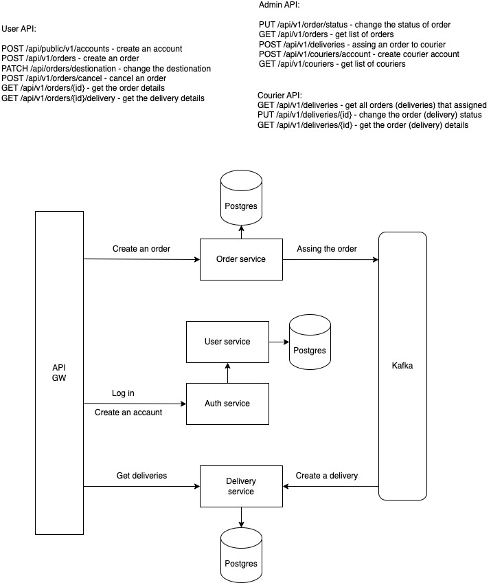

# parcel-delivery

## Getting Started

Make sure docker-compose is installed

#### Build jar files

Unix:

    ./build.sh

Windows:

    build.cmd

#### Running the application

    docker compose up -d

Application available on http://localhost:8080

## Users

Admin user:

login: **admin**, password: **admin**

Register a new user:

POST /api/public/v1/auth/register {login, password}

Create a courier account, requires an **admin account**:

POST /api/v1/auth/courier/register {login, password}

## Postman collection

Import *Parcel.postman_collection.json* file in root directory

## Architecture

## Swagger API schema

[User service](http://localhost:8001/swagger-ui/index.html)

[Auth service](http://localhost:8002/swagger-ui/index.html)

[Order service](http://localhost:8003/swagger-ui/index.html)

[Delivery service](http://localhost:8004/swagger-ui/index.html)

## Todo

- Error handling (not fully completed) 
- Unit test coverage 
- Integration tests